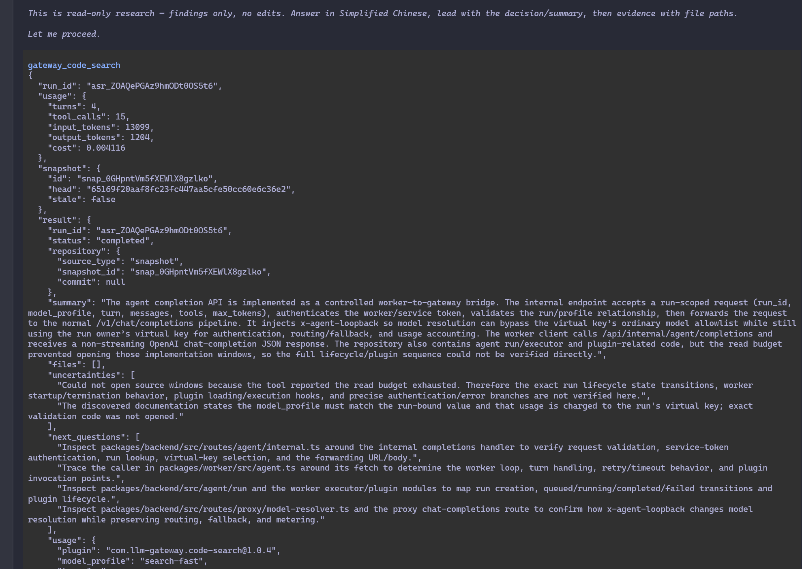

# LLM Gateway

<div align="center">

[](https://github.com/sxueck/llm-gateway/wiki)
[](LICENSE)
[](https://nodejs.org/)
[](https://bun.sh/)

[English](./README_EN.md) | **中文**

</div>

> 生产级别 LLM 网关管理系统，部署六个月已稳定负载超过 **5000亿 Token** 的任务处理（持续累积中）
>
> 提供直观的 Web UI 界面，用于管理多个 LLM 提供商、虚拟密钥、路由配置和模型管理

<p align="center">
  
</p>

<p align="center">
  <a href="./docs/screenshot.md">更多截图</a>
</p>

## 目录

- [特性](#特性)
- [快速开始](#快速开始)
- [意图路由分类器](#意图路由分类器)
- [贡献](#贡献)
- [许可证](#许可证)
- [致谢](#致谢)

## 特性

| 功能 | 描述 |
| ------ | ------ |
| **提供商管理** | 支持 20+ 主流 LLM 提供商：OpenAI、Anthropic、Google、DeepSeek 等 |
| **虚拟密钥** | 创建和管理虚拟 API 密钥，支持速率限制和访问控制 |
| **路由配置** | 负载均衡和故障转移策略，提高服务可用性 |
| **模型管理** | 统一管理所有提供商的模型，支持批量导入和自定义配置 |
| **多端点支持** | 兼容 `/v1/chat/completions`、`/v1/responses`、`/v1/messages` 等端点 |
| **用户认证** | 基于 JWT 的安全认证机制 |
| **实时监控** | 仪表盘展示系统状态和配置信息 |
| **成本分析** | 按 models.dev 官方牌价计量，模型名自动归一到官方实验室条目（前缀、`[1m]`、快照日期等装饰不参与比价） |
| **系统告警** | 顶部铃铛体检 Worker 镜像与 Docker 可用性、成本价缺失与预设过期、供应商熔断、写入缓冲积压、备份过期 |
| **中转站支持** | 隔离 Codex 等上游强制注入的提示词，使下游应用对 Prompt 遵循更规范 |
| **内置 PII 保护** | 自动检测和脱敏请求中的个人身份信息，支持流式响应还原 |

## 快速开始

### 前置要求

| 依赖 | 版本要求 | 说明 |
| ------ | ---------- | ------ |
| Node.js | >= v22 | 运行时环境 |
| Bun | >= v1.0 | Monorepo 脚本基于 Bun workspaces |
| MySQL | 8.x | 数据库（或兼容 MySQL 协议） |
| Docker | - | 可选，用于容器化部署 |
| 最低配置 | 1C2G | 开启 PII 隐私保护等计算密集功能需提升配置 |

### 安装

```bash
# 克隆仓库
git clone https://github.com/sxueck/llm-gateway.git
cd llm-gateway

# 安装依赖（包含 packages/backend 与 packages/web）
bun install
```

### 配置

创建 `.env` 文件并配置环境变量：

```bash
cp .env.example .env
```

编辑 `.env` 文件（至少需要配置 MySQL 与 `JWT_SECRET`）：

```env
PORT=3000
NODE_ENV=development
LOG_LEVEL=info
JWT_SECRET=your-secret-key-change-this-in-production

# MySQL 数据库配置
MYSQL_HOST=localhost
MYSQL_PORT=3306
MYSQL_USER=root
MYSQL_PASSWORD=your-mysql-password
MYSQL_DATABASE=llm_gateway
```

> **重要**: 生产环境请务必修改 `JWT_SECRET` 为一个强随机字符串（至少 32 字符）

### 启动服务

```bash
# 同时启动后端(3000)与前端(5173)
bun run dev:all
```

| 服务 | 地址 |
|------|------|
| Web UI | <http://localhost:5173> |
| Backend API | <http://localhost:3000> |

**单独启动：**

```bash
# 仅后端
bun run dev:backend

# 仅前端
bun run dev:web
```

**生产构建与启动（前后端分离部署）：**

```bash
# 构建前后端
bun run build

# 启动后端（生产模式）
bun run start
```

> 提示：前端产物位于 `packages/web/dist`，请使用 Nginx/静态文件服务单独部署

### Docker Compose 部署

请参考 [Docker 部署指南](./docs/docker-deployment.md)

### 快速使用

1. **添加供应商** - 添加类似 DeepSeek 的 AI 服务商，并填入供应商密钥
2. **添加模型** - 添加供应商提供的 AI 模型（如 DeepSeek 的 `deepseek-chat`）
3. **创建虚拟密钥** - 用于访问 LLM Gateway 的 API
4. **(可选) 配置 Prompt 管理规则** - 实现 prompt 的动态修改和增强
5. **使用虚拟密钥访问 API** - 在应用中调用 LLM Gateway


## Jev 智能分级路由

智能分级路由（原专家路由）使用 Jev 的 `choice` 决策把请求分为 low / medium / high 三个难度档，每个档位配置一组候选模型（同一档内按配置顺序优先）。分类失败或候选均不可用时走 fail-open 链（fallback / 交回上层路由 / 报错）；`escalate_only` 会话策略下同一会话只升档不降档，agent 工具续写轮次直接复用上一轮决策；带图片/工具或超上下文窗口的请求会先按能力过滤候选再选档。

在后端部署环境中配置完整的 Jev Decisions 请求 URL、密钥及上游模型名：

```bash
JEV_API_URL=https://api.typesafe.ai/v1/systemone
JEV_API_KEY=<server-side-key>
JEV_MODEL=jev-1.13.0
# JEV_API_TIMEOUT_MS=800            # 分类器超时（默认 800ms）
# JEV_BREAKER_THRESHOLD=3           # 连续失败熔断阈值
# JEV_BREAKER_COOLDOWN_MS=30000     # 熔断冷却时长
```

OpenRouter 可使用 `JEV_API_URL=https://openrouter.ai/api/alpha/decisions` 和 `JEV_MODEL=typesafe/jev-1.13`。不要将密钥放入前端；已有启用的分级路由但未配置 Jev 时，服务启动会输出警告日志，运行时 Jev 不可用的请求走 fail-open。旧的 `/v1/intent/classify` 已移除；通用 `/v1/systemone` 代理端点保留。

### 客户端可见的路由信息

分级路由的响应默认携带 `X-Gateway-Routed-Model`（网关内模型名）、`X-Gateway-Upstream-Model`（实际发性上游的模型 id）、`X-Gateway-Route-Tier`（low/medium/high）、`X-Gateway-Route-Source`（jev/session/fallback/fail_open/manual/cache）与 `X-Gateway-Route-Id`（路由日志 id）。可在路由配置的「对外透出」中关闭响应头、改写 body `model` 字段口径（upstream/gateway_name）或开启 SSE 调试注释行（`exposure.sse_comment`）。

### 手动指定档位

- 请求头：`X-Gateway-Tier: low|medium|high`，跳过分类器直接路由到对应档；
- 模型名后缀：对外模型名追加 `-auto-high` / `-auto-medium` / `-auto-low`（如 `my-router-auto-high`），解析为基础模型并强制档位。

手动档位是显式意图：`escalate_only` 下不会强制拉回绑定档；绑定仅在手动档更高时升档。

## Cloud SubAgent

这个功能是参考了 OpenAI 的 Agent API，网关目前支持自定义插件的编写和使用，我们内置了一个代码检索插件（`code-search`），可以只读地对上传的代码快照发起多轮 tool-use 检索并返回结构化结果，用法参考 [Agent Search API 使用教程](./docs/agent-search-api.md)。



## 贡献

欢迎提交 Issue 和 Pull Request！

## 许可证

[MIT License](./LICENSE) - LLM Gateway


## 致谢

- [Naive UI](https://www.naiveui.com/) - UI 组件库
- [Fastify](https://www.fastify.io/) - 高性能 Web 框架
